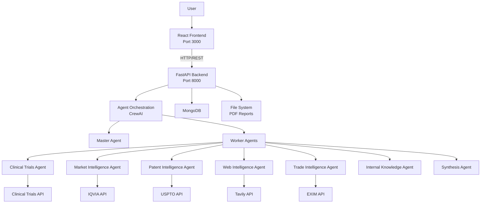
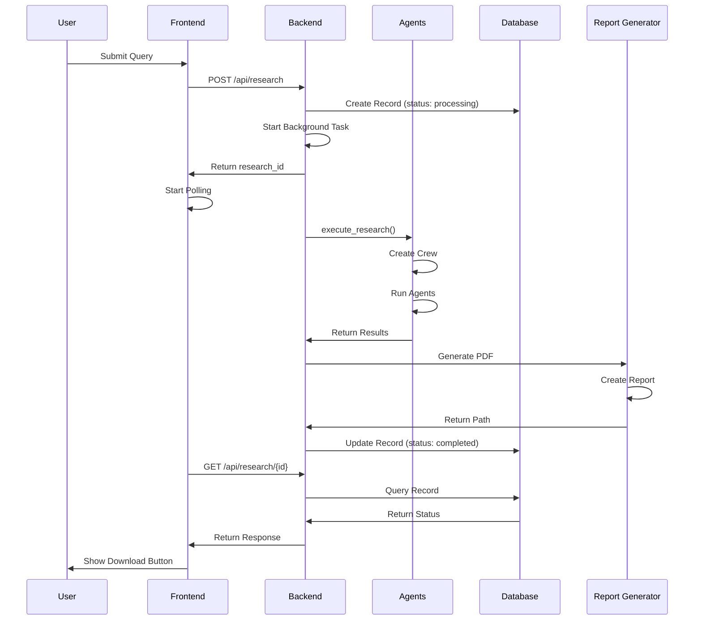
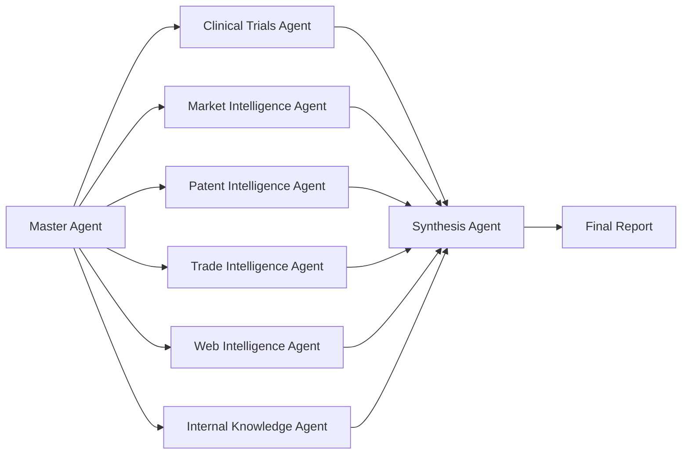

# Technical Diagrams

This document contains comprehensive technical diagrams for the Techathon project architecture.

## Table of Contents
1. [System Architecture Diagram](#1-system-architecture-diagram)
2. [Data Flow Diagram](#2-data-flow-diagram)
3. [Component Interaction Diagram](#3-component-interaction-diagram)
4. [Agent System Architecture](#4-agent-system-architecture)
5. [API Request Flow](#5-api-request-flow)
6. [Database Schema](#6-database-schema)
7. [Deployment Architecture](#7-deployment-architecture)

---

## 1. System Architecture Diagram

### High-Level System Architecture

```
┌─────────────────────────────────────────────────────────────────────────────┐
│                           CLIENT LAYER                                       │
│                                                                              │
│  ┌──────────────────────────────────────────────────────────────────────┐   │
│  │                    React Frontend Application                        │   │
│  │                    (Port 3000)                                      │   │
│  │                                                                       │   │
│  │  ┌──────────────────────────────────────────────────────────────┐   │   │
│  │  │  ChatInterface Component                                      │   │   │
│  │  │  - User Input Handling                                        │   │   │
│  │  │  - Status Polling                                              │   │   │
│  │  │  - PDF Download                                                │   │   │
│  │  └──────────────────────────────────────────────────────────────┘   │   │
│  │                                                                       │   │
│  │  ┌──────────────────────────────────────────────────────────────┐   │   │
│  │  │  UI Components (shadcn/ui)                                    │   │   │
│  │  │  - Buttons, Cards, Icons                                      │   │   │
│  │  └──────────────────────────────────────────────────────────────┘   │   │
│  │                                                                       │   │
│  │  State Management: React Hooks (useState, useEffect, useCallback)    │   │
│  └──────────────────────────────────────────────────────────────────────┘   │
└─────────────────────────────────────────────────────────────────────────────┘
                                    │
                                    │ HTTP/REST API
                                    │ (Axios)
                                    ▼
┌─────────────────────────────────────────────────────────────────────────────┐
│                           API LAYER                                          │
│                                                                              │
│  ┌──────────────────────────────────────────────────────────────────────┐   │
│  │                    FastAPI Backend Server                              │   │
│  │                    (Port 8000)                                         │   │
│  │                                                                         │   │
│  │  ┌──────────────────────────────────────────────────────────────┐     │   │
│  │  │  API Router (/api)                                            │     │   │
│  │  │  - GET  /api/                                                  │     │   │
│  │  │  - POST /api/research                                          │     │   │
│  │  │  - GET  /api/research/{id}                                     │     │   │
│  │  │  - GET  /api/research/{id}/download                            │     │   │
│  │  │  - POST /api/status                                            │     │   │
│  │  │  - GET  /api/status                                            │     │   │
│  │  └──────────────────────────────────────────────────────────────┘     │   │
│  │                                                                         │   │
│  │  ┌──────────────────────────────────────────────────────────────┐     │   │
│  │  │  Middleware                                                    │     │   │
│  │  │  - CORS Middleware                                             │     │   │
│  │  │  - Request Validation (Pydantic)                              │     │   │
│  │  │  - Error Handling                                              │     │   │
│  │  └──────────────────────────────────────────────────────────────┘     │   │
│  │                                                                         │   │
│  │  ┌──────────────────────────────────────────────────────────────┐     │   │
│  │  │  Background Tasks                                              │     │   │
│  │  │  - execute_research()                                          │     │   │
│  │  │  - Async processing                                            │     │   │
│  │  └──────────────────────────────────────────────────────────────┘     │   │
│  └──────────────────────────────────────────────────────────────────────┘   │
└─────────────────────────────────────────────────────────────────────────────┘
                                    │
                                    ▼
┌─────────────────────────────────────────────────────────────────────────────┐
│                      AGENT ORCHESTRATION LAYER                               │
│                                                                              │
│  ┌──────────────────────────────────────────────────────────────────────┐   │
│  │                    CrewAI Framework                                   │   │
│  │                                                                         │   │
│  │  ┌──────────────────────────────────────────────────────────────┐     │   │
│  │  │  Master Agent                                                │     │   │
│  │  │  - Query Analysis                                            │     │   │
│  │  │  - Task Orchestration                                        │     │   │
│  │  │  - Result Synthesis                                          │     │   │
│  │  └──────────────────────────────────────────────────────────────┘     │   │
│  │                            │                                            │   │
│  │                            ▼                                            │   │
│  │  ┌──────────────────────────────────────────────────────────────┐     │   │
│  │  │  Worker Agents (7 Specialized Agents)                       │     │   │
│  │  │  ┌──────────────┐  ┌──────────────┐  ┌──────────────┐     │     │   │
│  │  │  │ Clinical      │  │ Market       │  │ Patent       │     │     │   │
│  │  │  │ Trials Agent  │  │ Intelligence │  │ Intelligence │     │     │   │
│  │  │  └──────────────┘  └──────────────┘  └──────────────┘     │     │   │
│  │  │  ┌──────────────┐  ┌──────────────┐  ┌──────────────┐     │     │   │
│  │  │  │ Trade        │  │ Web          │  │ Internal      │     │     │   │
│  │  │  │ Intelligence │  │ Intelligence │  │ Knowledge    │     │     │   │
│  │  │  └──────────────┘  └──────────────┘  └──────────────┘     │     │   │
│  │  │  ┌──────────────┐                                            │     │   │
│  │  │  │ Synthesis    │                                            │     │   │
│  │  │  │ Agent        │                                            │     │   │
│  │  │  └──────────────┘                                            │     │   │
│  │  └──────────────────────────────────────────────────────────────┘     │   │
│  └──────────────────────────────────────────────────────────────────────┘   │
└─────────────────────────────────────────────────────────────────────────────┘
                                    │
                                    ▼
┌─────────────────────────────────────────────────────────────────────────────┐
│                           TOOLS & SERVICES LAYER                            │
│                                                                              │
│  ┌──────────────┐  ┌──────────────┐  ┌──────────────┐  ┌──────────────┐    │
│  │ Clinical     │  │ Market Data  │  │ Patent Data  │  │ Web Search   │    │
│  │ Trials API   │  │ (IQVIA)      │  │ (USPTO)      │  │ (Tavily)     │    │
│  └──────────────┘  └──────────────┘  └──────────────┘  └──────────────┘    │
│                                                                              │
│  ┌──────────────┐  ┌──────────────┐  ┌──────────────┐                      │
│  │ Trade Data   │  │ Internal     │  │ Report       │                      │
│  │ (EXIM)       │  │ Knowledge    │  │ Generator    │                      │
│  └──────────────┘  └──────────────┘  └──────────────┘                      │
└─────────────────────────────────────────────────────────────────────────────┘
                                    │
                                    ▼
┌─────────────────────────────────────────────────────────────────────────────┐
│                           DATA PERSISTENCE LAYER                             │
│                                                                              │
│  ┌──────────────────────────────────┐  ┌──────────────────────────────────┐  │
│  │  MongoDB Database                │  │  File System                     │  │
│  │  - research_queries              │  │  - PDF Reports                  │  │
│  │  - status_checks                  │  │  - Generated Reports             │  │
│  └──────────────────────────────────┘  └──────────────────────────────────┘  │
└─────────────────────────────────────────────────────────────────────────────┘
```

---

## 2. Data Flow Diagram

### Research Query Flow

```
┌─────────────┐
│   User      │
│  Input      │
└──────┬──────┘
       │
       │ 1. User submits query
       ▼
┌─────────────────────────────────────────────────────────────┐
│  Frontend: ChatInterface.jsx                              │
│  ┌─────────────────────────────────────────────────────┐ │
│  │ handleSubmit()                                       │ │
│  │ - Validates input                                    │ │
│  │ - Sets loading state                                 │ │
│  │ - POST /api/research                                 │ │
│  └─────────────────────────────────────────────────────┘ │
└─────────────────────────────────────────────────────────────┘
       │
       │ 2. HTTP POST Request
       ▼
┌─────────────────────────────────────────────────────────────┐
│  Backend: server.py                                         │
│  ┌─────────────────────────────────────────────────────┐ │
│  │ POST /api/research                                  │ │
│  │ - Validates request (Pydantic)                      │ │
│  │ - Generates research_id (UUID)                       │ │
│  │ - Creates MongoDB record                            │ │
│  │ - Starts background task                            │ │
│  │ - Returns ResearchResponse immediately              │ │
│  └─────────────────────────────────────────────────────┘ │
└─────────────────────────────────────────────────────────────┘
       │
       │ 3. Background Task: execute_research()
       ▼
┌─────────────────────────────────────────────────────────────┐
│  Agent Orchestration                                         │
│  ┌─────────────────────────────────────────────────────┐ │
│  │ create_research_crew(query)                          │ │
│  │ - Creates Master Agent                               │ │
│  │ - Creates 7 Worker Agents                            │ │
│  │ - Defines tasks                                      │ │
│  │ - Creates Crew                                       │ │
│  └─────────────────────────────────────────────────────┘ │
│                    │                                        │
│                    ▼                                        │
│  ┌─────────────────────────────────────────────────────┐ │
│  │ crew.kickoff()                                       │ │
│  │ - Master Agent analyzes query                        │ │
│  │ - Delegates tasks to Worker Agents                   │ │
│  │ - Worker Agents execute in sequence                  │ │
│  │ - Synthesis Agent combines results                   │ │
│  │ - Returns aggregated result                           │ │
│  └─────────────────────────────────────────────────────┘ │
└─────────────────────────────────────────────────────────────┘
       │
       │ 4. Process Results
       ▼
┌─────────────────────────────────────────────────────────────┐
│  Report Generation                                           │
│  ┌─────────────────────────────────────────────────────┐ │
│  │ generate_research_report()                           │ │
│  │ - Structures data                                    │ │
│  │ - Creates PDF using ReportLab                        │ │
│  │ - Saves to reports/ directory                        │ │
│  └─────────────────────────────────────────────────────┘ │
└─────────────────────────────────────────────────────────────┘
       │
       │ 5. Update Database
       ▼
┌─────────────────────────────────────────────────────────────┐
│  MongoDB Update                                              │
│  ┌─────────────────────────────────────────────────────┐ │
│  │ db.research_queries.update_one()                     │ │
│  │ - Sets status = "completed"                          │ │
│  │ - Stores result data                                 │ │
│  │ - Stores report_path                                 │ │
│  │ - Sets completed_at timestamp                        │ │
│  └─────────────────────────────────────────────────────┘ │
└─────────────────────────────────────────────────────────────┘
       │
       │ 6. Frontend Polling (every 3 seconds)
       ▼
┌─────────────────────────────────────────────────────────────┐
│  Frontend: Status Polling                                    │
│  ┌─────────────────────────────────────────────────────┐ │
│  │ checkResearchStatus(id)                              │ │
│  │ - GET /api/research/{id}                             │ │
│  │ - Updates UI state                                   │ │
│  │ - Shows download button when completed               │ │
│  └─────────────────────────────────────────────────────┘ │
└─────────────────────────────────────────────────────────────┘
```

### Status Polling Flow

```
┌─────────────────────────────────────────────────────────────┐
│  Frontend: useEffect Hook                                    │
│  ┌─────────────────────────────────────────────────────┐ │
│  │ Polling Interval (every 3 seconds)                   │ │
│  │ - checkResearchStatus(pollingId)                      │ │
│  └─────────────────────────────────────────────────────┘ │
└─────────────────────────────────────────────────────────────┘
       │
       │ GET /api/research/{id}
       ▼
┌─────────────────────────────────────────────────────────────┐
│  Backend: get_research_status()                              │
│  ┌─────────────────────────────────────────────────────┐ │
│  │ - Queries MongoDB                                     │ │
│  │ - Returns ResearchResponse                            │ │
│  └─────────────────────────────────────────────────────┘ │
└─────────────────────────────────────────────────────────────┘
       │
       │ Response
       ▼
┌─────────────────────────────────────────────────────────────┐
│  Frontend: State Update                                      │
│  ┌─────────────────────────────────────────────────────┐ │
│  │ - Updates researches state                            │ │
│  │ - If status === "completed" or "failed":             │ │
│  │   - Stops polling                                    │ │
│  │   - Shows download button (if completed)             │ │
│  └─────────────────────────────────────────────────────┘ │
└─────────────────────────────────────────────────────────────┘
```

---

## 3. Component Interaction Diagram

```
┌─────────────────────────────────────────────────────────────────┐
│                      USER INTERFACE                             │
└─────────────────────────────────────────────────────────────────┘
                            │
                            │ User Actions
                            ▼
┌─────────────────────────────────────────────────────────────────┐
│              ChatInterface Component                            │
│  ┌─────────────────────────────────────────────────────────┐ │
│  │ State:                                                    │ │
│  │ - query: string                                           │ │
│  │ - researches: Research[]                                 │ │
│  │ - loading: boolean                                       │ │
│  │ - pollingId: string | null                               │ │
│  └─────────────────────────────────────────────────────────┘ │
│                                                                 │
│  ┌─────────────────────────────────────────────────────────┐ │
│  │ Event Handlers:                                           │ │
│  │ - handleSubmit() → POST /api/research                    │ │
│  │ - checkResearchStatus() → GET /api/research/{id}         │ │
│  │ - handleDownload() → GET /api/research/{id}/download     │ │
│  └─────────────────────────────────────────────────────────┘ │
└─────────────────────────────────────────────────────────────────┘
                            │
                            │ HTTP Requests (Axios)
                            ▼
┌─────────────────────────────────────────────────────────────────┐
│                    FastAPI Backend                              │
│  ┌─────────────────────────────────────────────────────────┐ │
│  │ API Router                                                │ │
│  │ - POST /api/research                                      │ │
│  │ - GET  /api/research/{id}                                 │ │
│  │ - GET  /api/research/{id}/download                       │ │
│  └─────────────────────────────────────────────────────────┘ │
│                            │                                    │
│                            ▼                                    │
│  ┌─────────────────────────────────────────────────────────┐ │
│  │ Background Tasks                                          │ │
│  │ - execute_research()                                      │ │
│  └─────────────────────────────────────────────────────────┘ │
│                            │                                    │
│                            ▼                                    │
│  ┌─────────────────────────────────────────────────────────┐ │
│  │ Agent System                                              │ │
│  │ - create_research_crew()                                  │ │
│  │ - crew.kickoff()                                          │ │
│  └─────────────────────────────────────────────────────────┘ │
└─────────────────────────────────────────────────────────────────┘
                            │
                            │ Data Operations
                            ▼
┌─────────────────────────────────────────────────────────────────┐
│                    Data Layer                                    │
│  ┌──────────────────┐              ┌──────────────────┐      │
│  │ MongoDB          │              │ File System       │      │
│  │ - research_queries│              │ - PDF Reports     │      │
│  │ - status_checks  │              │                   │      │
│  └──────────────────┘              └──────────────────┘      │
└─────────────────────────────────────────────────────────────────┘
```

---

## 4. Agent System Architecture

### Master-Worker Agent Pattern

```
┌─────────────────────────────────────────────────────────────────┐
│                    MASTER AGENT                                  │
│  ┌───────────────────────────────────────────────────────────┐ │
│  │ Role: Master Research Orchestrator                         │ │
│  │ Goal: Analyze queries & orchestrate research               │ │
│  │                                                             │ │
│  │ Responsibilities:                                          │ │
│  │ - Query analysis & refinement                              │ │
│  │ - Task planning & delegation                               │ │
│  │ - Result synthesis                                         │ │
│  │                                                             │ │
│  │ Tools: None (orchestrates only)                            │ │
│  │ LLM: Gemini 1.5 Pro                                        │ │
│  └───────────────────────────────────────────────────────────┘ │
└─────────────────────────────────────────────────────────────────┘
                            │
                            │ Delegates Tasks
                            ▼
┌─────────────────────────────────────────────────────────────────┐
│                    WORKER AGENTS                                │
│                                                                  │
│  ┌──────────────┐  ┌──────────────┐  ┌──────────────┐         │
│  │ Clinical      │  │ Market       │  │ Patent       │         │
│  │ Trials Agent │  │ Intelligence │  │ Intelligence │         │
│  │              │  │ Agent        │  │ Agent        │         │
│  │ Tool:        │  │ Tool:        │  │ Tool:        │         │
│  │ search_      │  │ iqvia_       │  │ patent_      │         │
│  │ clinical_    │  │ market_      │  │ landscape_  │         │
│  │ trials_tool  │  │ tool         │  │ tool         │         │
│  └──────────────┘  └──────────────┘  └──────────────┘         │
│                                                                  │
│  ┌──────────────┐  ┌──────────────┐  ┌──────────────┐         │
│  │ Trade        │  │ Web          │  │ Internal     │         │
│  │ Intelligence │  │ Intelligence │  │ Knowledge    │         │
│  │ Agent        │  │ Agent        │  │ Agent        │         │
│  │              │  │              │  │              │         │
│  │ Tool:        │  │ Tool:        │  │ Tool:        │         │
│  │ exim_        │  │ web_         │  │ internal_    │         │
│  │ trade_tool   │  │ search_tool  │  │ knowledge_  │         │
│  └──────────────┘  └──────────────┘  └──────────────┘         │
│                                                                  │
│  ┌──────────────┐                                               │
│  │ Synthesis    │                                               │
│  │ Agent        │                                               │
│  │              │                                               │
│  │ Tool: None   │                                               │
│  │ (Synthesizes │                                               │
│  │  all results)│                                               │
│  └──────────────┘                                               │
└─────────────────────────────────────────────────────────────────┘
                            │
                            │ Results
                            ▼
┌─────────────────────────────────────────────────────────────────┐
│                    AGGREGATED RESULTS                            │
│  - Clinical trials data                                           │
│  - Market intelligence                                           │
│  - Patent landscape                                              │
│  - Trade data                                                    │
│  - Web search results                                            │
│  - Internal knowledge                                            │
│  - Executive summary                                             │
└─────────────────────────────────────────────────────────────────┘
```

### Agent Execution Flow

```
┌─────────────────────────────────────────────────────────────────┐
│  Task 1: Scope Task (Master Agent)                              │
│  - Understands and refines research question                    │
│  - Breaks down into sub-questions                               │
│  - Outlines research plan                                       │
└─────────────────────────────────────────────────────────────────┘
                            │
                            ▼
┌─────────────────────────────────────────────────────────────────┐
│  Task 2: Clinical Trials (Clinical Trials Agent)                │
│  - Searches ClinicalTrials.gov                                   │
│  - Analyzes trial phases and geographies                         │
│  - Identifies key sponsors                                       │
└─────────────────────────────────────────────────────────────────┘
                            │
                            ▼
┌─────────────────────────────────────────────────────────────────┐
│  Task 3: Market Analysis (Market Intelligence Agent)             │
│  - Retrieves IQVIA market data                                  │
│  - Analyzes market size and growth                              │
│  - Identifies key competitors                                    │
└─────────────────────────────────────────────────────────────────┘
                            │
                            ▼
┌─────────────────────────────────────────────────────────────────┐
│  Task 4: Trade Analysis (Trade Intelligence Agent)             │
│  - Analyzes EXIM trade data                                     │
│  - Identifies import/export trends                              │
│  - Assesses supply chain dependencies                           │
└─────────────────────────────────────────────────────────────────┘
                            │
                            ▼
┌─────────────────────────────────────────────────────────────────┐
│  Task 5: Patent Analysis (Patent Intelligence Agent)            │
│  - Assesses patent landscape                                    │
│  - Identifies patent cliffs                                     │
│  - Evaluates FTO opportunities                                  │
└─────────────────────────────────────────────────────────────────┘
                            │
                            ▼
┌─────────────────────────────────────────────────────────────────┐
│  Task 6: Web Search (Web Intelligence Agent)                    │
│  - Searches medical literature                                 │
│  - Finds recent developments                                    │
│  - Gathers external signals                                     │
└─────────────────────────────────────────────────────────────────┘
                            │
                            ▼
┌─────────────────────────────────────────────────────────────────┐
│  Task 7: Internal Knowledge (Internal Knowledge Agent)          │
│  - Searches internal documents                                  │
│  - Finds prior research                                         │
│  - Identifies strategic alignment                               │
└─────────────────────────────────────────────────────────────────┘
                            │
                            ▼
┌─────────────────────────────────────────────────────────────────┐
│  Task 8: Synthesis (Synthesis Agent)                            │
│  - Combines all findings                                        │
│  - Creates executive summary                                    │
│  - Generates recommendations                                    │
└─────────────────────────────────────────────────────────────────┘
```

---

## 5. API Request Flow

### Research Query Request Flow

```
┌──────────┐
│  Client  │
└────┬─────┘
     │
     │ POST /api/research
     │ Body: { "query": "..." }
     ▼
┌─────────────────────────────────────────────────────────────┐
│  FastAPI: server.py                                          │
│  ┌───────────────────────────────────────────────────────┐ │
│  │ @api_router.post("/research")                          │ │
│  │ async def start_research(                              │ │
│  │     query: ResearchQuery,                              │ │
│  │     background_tasks: BackgroundTasks                 │ │
│  │ )                                                      │ │
│  └───────────────────────────────────────────────────────┘ │
│         │                                                    │
│         │ 1. Validate request (Pydantic)                    │
│         ▼                                                    │
│  ┌───────────────────────────────────────────────────────┐ │
│  │ 2. Generate research_id (UUID)                        │ │
│  └───────────────────────────────────────────────────────┘ │
│         │                                                    │
│         │ 3. Create MongoDB record                          │
│         ▼                                                    │
│  ┌───────────────────────────────────────────────────────┐ │
│  │ await db.research_queries.insert_one({                  │ │
│  │     "id": research_id,                                  │ │
│  │     "query": query.query,                               │ │
│  │     "status": "processing",                             │ │
│  │     ...                                                 │ │
│  │ })                                                      │ │
│  └───────────────────────────────────────────────────────┘ │
│         │                                                    │
│         │ 4. Start background task                          │
│         ▼                                                    │
│  ┌───────────────────────────────────────────────────────┐ │
│  │ background_tasks.add_task(                             │ │
│  │     execute_research,                                  │ │
│  │     research_id,                                       │ │
│  │     query.query                                         │ │
│  │ )                                                       │ │
│  └───────────────────────────────────────────────────────┘ │
│         │                                                    │
│         │ 5. Return immediately                              │
│         ▼                                                    │
│  ┌───────────────────────────────────────────────────────┐ │
│  │ return ResearchResponse(                               │ │
│  │     id=research_id,                                    │ │
│  │     query=query.query,                                 │ │
│  │     status="processing",                              │ │
│  │     created_at=datetime.now()                         │ │
│  │ )                                                      │ │
│  └───────────────────────────────────────────────────────┘ │
└─────────────────────────────────────────────────────────────┘
     │
     │ HTTP 200 Response
     │ { "id": "...", "status": "processing", ... }
     ▼
┌──────────┐
│  Client  │
│  (Frontend)
└──────────┘
```

### Status Check Request Flow

```
┌──────────┐
│  Client  │
└────┬─────┘
     │
     │ GET /api/research/{research_id}
     ▼
┌─────────────────────────────────────────────────────────────┐
│  FastAPI: server.py                                          │
│  ┌───────────────────────────────────────────────────────┐ │
│  │ @api_router.get("/research/{research_id}")             │ │
│  │ async def get_research_status(research_id: str)        │ │
│  └───────────────────────────────────────────────────────┘ │
│         │                                                    │
│         │ 1. Query MongoDB                                   │
│         ▼                                                    │
│  ┌───────────────────────────────────────────────────────┐ │
│  │ research = await db.research_queries.find_one(        │ │
│  │     {"id": research_id},                               │ │
│  │     {"_id": 0}                                          │ │
│  │ )                                                       │ │
│  └───────────────────────────────────────────────────────┘ │
│         │                                                    │
│         │ 2. Check if found                                 │
│         ▼                                                    │
│  ┌───────────────────────────────────────────────────────┐ │
│  │ if not research:                                       │ │
│  │     raise HTTPException(404, "Research not found")     │ │
│  └───────────────────────────────────────────────────────┘ │
│         │                                                    │
│         │ 3. Convert timestamps                             │
│         ▼                                                    │
│  ┌───────────────────────────────────────────────────────┐ │
│  │ research['created_at'] = datetime.fromisoformat(...)   │ │
│  │ if research.get('completed_at'):                       │ │
│  │     research['completed_at'] = datetime.fromisoformat(...)│ │
│  └───────────────────────────────────────────────────────┘ │
│         │                                                    │
│         │ 4. Return response                                │
│         ▼                                                    │
│  ┌───────────────────────────────────────────────────────┐ │
│  │ return ResearchResponse(**research)                     │ │
│  └───────────────────────────────────────────────────────┘ │
└─────────────────────────────────────────────────────────────┘
     │
     │ HTTP 200 Response
     │ { "id": "...", "status": "completed", ... }
     ▼
┌──────────┐
│  Client  │
└──────────┘
```

---

## 6. Database Schema

### MongoDB Collections

#### research_queries Collection

```javascript
{
  "id": "uuid-string",                    // Unique research ID
  "query": "string",                       // User's research query
  "status": "processing" | "completed" | "failed",
  "result": {
    "raw_output": "string",                // Raw agent output
    "structured_data": {                   // Structured data
      "query": "string",
      "executive_summary": "string",
      "key_findings": ["string"],
      "diseases": [
        {
          "name": "string",
          "burden": "string",
          "competition": "string",
          "market_size": "string",
          "opportunity": "string"
        }
      ],
      "recommendations": ["string"],
      "next_steps": ["string"]
    }
  },
  "report_path": "string" | null,          // Path to PDF report
  "created_at": "ISO datetime string",
  "completed_at": "ISO datetime string" | null
}
```

#### status_checks Collection

```javascript
{
  "id": "uuid-string",                    // Unique status check ID
  "client_name": "string",                 // Client identifier
  "timestamp": "ISO datetime string"       // When check was created
}
```

### File System Structure

```
backend/
└── reports/
    ├── report_{research_id_1}.pdf
    ├── report_{research_id_2}.pdf
    └── ...
```

---

## 7. Deployment Architecture

### Development Environment

```
┌─────────────────────────────────────────────────────────────┐
│                    Development Machine                       │
│                                                               │
│  ┌──────────────────┐         ┌──────────────────┐        │
│  │  Frontend        │         │  Backend          │        │
│  │  (React)         │         │  (FastAPI)        │        │
│  │  Port 3000       │◄───────►│  Port 8000        │        │
│  │  npm start       │         │  uvicorn          │        │
│  └──────────────────┘         └──────────────────┘        │
│                                                               │
│  ┌──────────────────┐         ┌──────────────────┐        │
│  │  MongoDB         │         │  File System      │        │
│  │  (Local)         │         │  (Local)         │        │
│  │  Port 27017      │         │  reports/        │        │
│  └──────────────────┘         └──────────────────┘        │
└─────────────────────────────────────────────────────────────┘
```

### Production Environment

```
┌─────────────────────────────────────────────────────────────┐
│                    Load Balancer / Reverse Proxy             │
│                    (Nginx / Cloudflare)                      │
└─────────────────────────────────────────────────────────────┘
                            │
                            ▼
┌─────────────────────────────────────────────────────────────┐
│                    Frontend Server                           │
│                    (Static Files)                             │
│                    - Vercel / Netlify / S3                   │
└─────────────────────────────────────────────────────────────┘
                            │
                            ▼
┌─────────────────────────────────────────────────────────────┐
│                    Backend Server                            │
│                    (FastAPI)                                 │
│                    - Docker Container                        │
│                    - AWS ECS / GCP Cloud Run                 │
│                    - Kubernetes Pod                          │
└─────────────────────────────────────────────────────────────┘
                            │
                            ▼
┌─────────────────────────────────────────────────────────────┐
│                    Database & Storage                        │
│                    ┌──────────────┐  ┌──────────────┐      │
│                    │  MongoDB      │  │  Object      │      │
│                    │  Atlas        │  │  Storage     │      │
│                    │  (Cloud)      │  │  (S3/GCS)    │      │
│                    └──────────────┘  └──────────────┘      │
└─────────────────────────────────────────────────────────────┘
```

---

## Mermaid Diagrams (for GitHub/Markdown viewers)

### System Architecture (Mermaid)



### Data Flow (Mermaid)



### Agent System (Mermaid)



---

## Diagram Usage

### For Presentations
- Use the ASCII diagrams for text-based documentation
- Use Mermaid diagrams for interactive presentations
- Export Mermaid diagrams to PNG/SVG using online tools

### For Documentation
- Include diagrams in markdown files
- Use Mermaid for GitHub/GitLab rendering
- Use ASCII for plain text compatibility

### Tools for Creating Diagrams
- **Mermaid Live Editor**: https://mermaid.live/
- **Draw.io**: https://app.diagrams.net/
- **Lucidchart**: https://www.lucidchart.com/
- **Excalidraw**: https://excalidraw.com/

---

## Notes

- All diagrams are designed to be clear and comprehensive
- ASCII diagrams work in any text viewer
- Mermaid diagrams render in GitHub, GitLab, and many markdown viewers
- Diagrams can be exported to images for presentations
- Update diagrams when architecture changes

